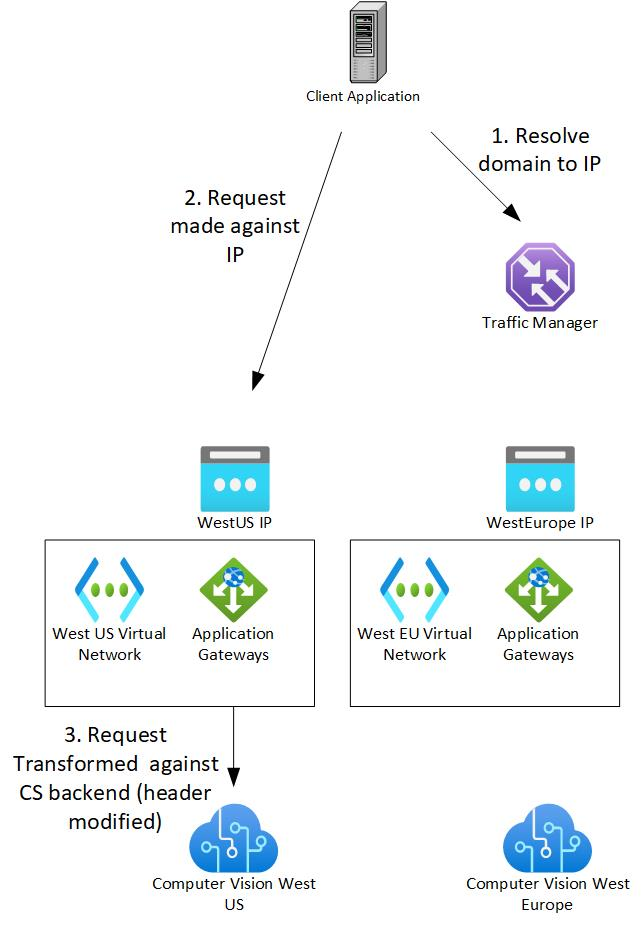

# Multi-regional Cognitive Services endpoint using Traffic Manager and AAD authentication

<!-- 
Guidelines on README format: https://review.docs.microsoft.com/help/onboard/admin/samples/concepts/readme-template?branch=master

Guidance on onboarding samples to docs.microsoft.com/samples: https://review.docs.microsoft.com/help/onboard/admin/samples/process/onboarding?branch=master

Taxonomies for products and languages: https://review.docs.microsoft.com/new-hope/information-architecture/metadata/taxonomies?branch=master
-->

Learn to create a single endpoint for multiple Cognitive Services resources using Traffic Manager, Azure Active Directory, and Application Gateway.

## Introduction

Each Cognitive Services resource is a regional endpoint traditionally accessed using a key that's unique to each resource. When creating a global application with a regional-agnostic client, this can be problematic since developers have to create middle tier services to store the keys and/or route traffic accordingly.

This sample proposes a solution by using Traffic Manager, AAD authentication, and Application Gateway to intelligently route traffic based on geography while allowing a single token to be used against two Computer Vision endpoints located in West US and West Europe. 

## Prerequisites

To try out the ARM template, simply click "Deploy to Azure" button to deploy to your favorite Subscription using Azure portal. Alternatively, the template can also be downloaded locally and deployed using Azure CLI.

For service principal ID, you will need to go to Azure Active Directory and create an application before hand. Please follow this [instruction](https://docs.microsoft.com/en-us/azure/active-directory/develop/howto-create-service-principal-portal) and make sure to user service principal Id and not the application object Id.

## Instruction

For instructions on how to get a Bearer token for the service principal created in prerequisite, please follow this [instruction](https://docs.microsoft.com/en-us/azure/cognitive-services/authentication?tabs=powershell#authenticate-with-azure-active-directory).

Once the ARM template is deployed, you can generate a request against the Traffic Manager endpoint (HTTP only) with the Bearer token representing the service principal.

## Key concepts

This ARM template create a total of nine resources as depicted in the diagram above. 

1. The Traffic Manager is configured to be routing based on geography to minimize latency. It can also be configured to be priority-based if what you are looking for is a fall-back mechanism.
2. The domain name is then resolved against public IP of Application Gateway for either West US or West Europe.
3. The most important job of the Application Gateway is to transform this request to a request on Cognitive Services endpoint while using the resource custom domain name. Cognitive Services uses the custom domain name to identify the resource so it's important to override the host name to the custom domain of the resource.

NOTE: the Application Gateway transforms a HTTP request to HTTPS. If a HTTPS front-end is desired, you will need to setup a certificate for the Application Gateway frontend. This is recommended but skipped for this sample due to simplification.

## Contributing

This project welcomes contributions and suggestions.  Most contributions require you to agree to a
Contributor License Agreement (CLA) declaring that you have the right to, and actually do, grant us
the rights to use your contribution. For details, visit https://cla.opensource.microsoft.com.

When you submit a pull request, a CLA bot will automatically determine whether you need to provide
a CLA and decorate the PR appropriately (e.g., status check, comment). Simply follow the instructions
provided by the bot. You will only need to do this once across all repos using our CLA.

This project has adopted the [Microsoft Open Source Code of Conduct](https://opensource.microsoft.com/codeofconduct/).
For more information see the [Code of Conduct FAQ](https://opensource.microsoft.com/codeofconduct/faq/) or
contact [opencode@microsoft.com](mailto:opencode@microsoft.com) with any additional questions or comments.
